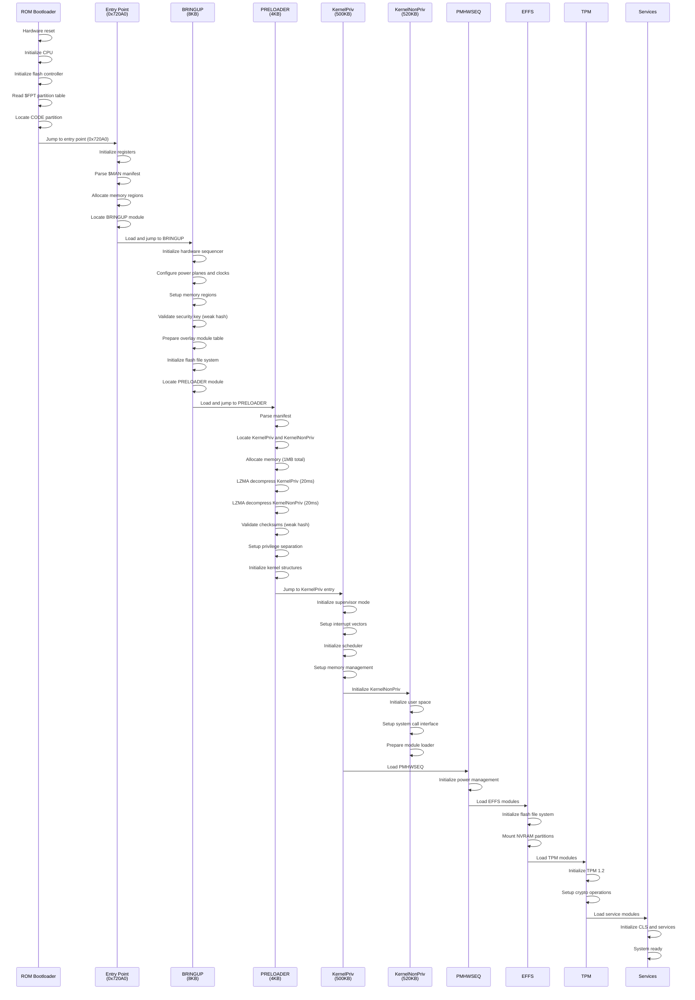

# Boot Sequence Overview

## Introduction

This document provides a comprehensive overview of the Intel ME1 firmware boot sequence, from hardware reset through Entry Point, BRINGUP, PRELOADER, to full kernel initialization. The analysis is based on reverse engineering of me1x200.bin firmware and individual module analysis using Rizin disassembler.

## Boot Architecture

### Firmware Structure

The ME1 firmware is organized in flash memory with the following layout:

```
0x00000000  Flash Partition Table ($FPT) at offset 0x10
0x00010000  FOVD partition (key storage - empty in ME1)
0x00072000  CODE partition header
0x000720A0  Entry point function
0x00080000  Module storage area
```

The CODE partition contains:
- Entry point code (embedded in partition)
- $MAN manifest with module metadata
- 18 modules (7 LZMA compressed, 11 uncompressed)
- Module loading infrastructure

### Boot Stages

The boot process consists of 5 distinct stages:

1. ROM execution (hardware reset)
2. Entry Point (bootloader initialization)
3. BRINGUP (early hardware initialization)
4. PRELOADER (kernel loading)
5. Kernel initialization (KernelPriv + KernelNonPriv)

## Complete Boot Sequence

```
ROM → Entry Point (0x720A0) → BRINGUP → PRELOADER → KernelPriv + KernelNonPriv → 
→ PMHWSEQ + Power overlays → BUP overlays → EFFS → TPM → Services → Optional modules
```

### Timeline

| Time | Stage | Module | Action |
|------|-------|--------|--------|
| 0ms | Reset | ROM | Hardware reset, ROM execution |
| 2ms | Boot | Entry Point | Parse CODE partition, initialize |
| 5ms | Init | BRINGUP | Hardware sequencer, memory setup |
| 10ms | Load | PRELOADER | Start kernel loading |
| 15ms | Decompress | PRELOADER | LZMA decompress KernelPriv (240KB → 500KB) |
| 35ms | Decompress | PRELOADER | LZMA decompress KernelNonPriv (250KB → 520KB) |
| 55ms | Setup | PRELOADER | Privilege separation, kernel bootstrap |
| 60ms | Transfer | PRELOADER | Jump to KernelPriv entry point |
| 60ms | Init | KernelPriv | Kernel initialization, scheduler start |
| 65ms | Init | KernelNonPriv | User space initialization |
| 70ms | Power | PMHWSEQ | Power management initialization |
| 75ms | Overlays | BUP overlays | Boot-up sequencer and CLS overlays |
| 80ms | FileSystem | EFFS | Embedded Flash File System initialization |
| 90ms | Security | TPM | TPM 1.2 initialization, crypto setup |
| 100ms | Services | CLS | Capability Licensing Service |
| 110ms+ | Optional | TDT, UPEK | Anti-theft and biometrics (if present) |

Total boot time: approximately 110ms for full initialization (excluding optional modules)

## Stage 0: Hardware Reset and ROM

### Hardware State

At power-on or reset:
- ARC processor starts execution from on-chip ROM
- ROM address: 0xFFFF0000 (not accessible for analysis)
- Hardware is in minimal state (no peripherals initialized)

### ROM Actions

The ROM bootloader performs:
1. Basic CPU initialization (registers, stack pointer)
2. Minimal hardware setup (clock, memory controller)
3. Flash controller initialization
4. Read Flash Partition Table ($FPT) at offset 0x10
5. Locate CODE partition (typically at 0x72000)
6. Parse CODE partition header
7. Extract entry point offset from header (+0xA0)
8. Transfer control to entry point (0x720A0)

### Security Note

ROM bootloader does NOT perform:
- Signature verification of CODE partition
- Secure boot validation
- Attestation or measurement

The ROM trusts flash content implicitly, making it vulnerable to firmware modification attacks.

## Stage 1: Entry Point

### Location

- Physical address: 0x720A0 in me1x200.bin
- Virtual address: 0x00401000 (after memory mapping)
- Size: Approximately 2KB (embedded in CODE partition)

### Module Header

The CODE partition begins with a module header at 0x72000:

```
Offset  Value       Description
+0x00   0x00000004  Header size indicator
+0x04   0x000000A1  Entry point offset (0xA0 aligned)
+0x1C   $MAN        Module manifest signature
+0x10   0x20081217  Build timestamp (2008-12-17)
```

Entry point calculation: 0x72000 + 0xA0 = 0x720A0

### Entry Point Actions

The entry point function performs:

1. Register initialization and stack setup
2. Parse $MAN manifest to locate modules
3. Initialize memory regions
4. Prepare for module loading
5. Transfer control to BRINGUP module

### Code Analysis

Entry point disassembly (first instructions):

```
0x720A0:  asl_s  r2, r12, 1
0x720A2:  extw_s r3, r13
0x720A4:  ld     r18, [r20, r52]
0x720A8:  ld_s   r14, pcl, 0x13c
0x720AA:  asl_s  r13, r2, 2
```

The function uses complex control flow with multiple conditional branches and indirect jumps. Rizin automatic analysis does not fully resolve all function calls due to indirect branching patterns.

### Transition to BRINGUP

The entry point function acts as a dispatcher that initializes the system and transfers control to the BRINGUP module. The BRINGUP module name is present in the firmware string table, indicating it is loaded dynamically during boot.

Module loading sequence:
1. Entry point at 0x720A0 initializes core system
2. Module loader identifies BRINGUP from partition table
3. BRINGUP module is loaded and executed
4. BRINGUP continues boot sequence to PRELOADER

### References

- Detailed entry point analysis: [entry-point.md](entry-point.md)
- CODE partition structure: reverse/me1/doc/note/code_entry_point.txt

## Stage 2: BRINGUP

### Module Information

- Module type: 0x05 (Bring-up module)
- File size: 8,148 bytes (0x1FD4)
- Compression: None (uncompressed)
- Load address: 0x00000000
- Entry point: 0x00000000

### Purpose

BRINGUP is the early boot initialization module in Intel ME1 firmware. It executes immediately after the Entry Point and is responsible for initializing the hardware sequencer, loading overlay modules, and preparing the system for PRELOADER execution.

### BRINGUP Actions

1. Hardware Sequencer Initialization
   - Initialize hardware sequencer
   - Configure power planes
   - Setup clock domains
   - Initialize AHB bus

2. Memory Configuration
   - Setup memory regions
   - Configure memory protection
   - Allocate heap and stack areas

3. Security Key Validation
   - Validate ME Security Key String Version 2
   - Perform basic security checks (weak 64-bit hash)

4. Overlay Module Table Setup
   - Prepare overlay module table with references to:
     - BUPMSEQ_OVL (BUP Sequencer Overlay)
     - BUCLS_OVL (BUP CLS Overlay)
     - EFFS_IOVL (Embedded Flash File System I/O)
     - EFFS_OPOVL (EFFS Operations)
     - MOFFM0_OVL (ME-OFF M0 Overlay)
     - MOFFM1_OVL (ME-OFF M1 Overlay)
     - SUPPORT_OVL (Support functions)
     - PKTPMINIT_OVL (PK-TPM Initialization)
     - ALIASCHECK_OVL (Alias checking)

5. Flash File System Initialization
   - Initialize flash access
   - Prepare for EFFS loading

6. Transfer Control to PRELOADER
   - Locate PRELOADER module
   - Setup PRELOADER parameters
   - Jump to PRELOADER entry point

### Key Functions

| Address | Function | Description |
|---------|----------|-------------|
| 0x00000000 | entry_point | Module entry point, initializes registers |
| 0x0000058C | main_init | Main initialization sequence |
| 0x00000A7C | hw_sequencer | Hardware sequencer control |
| 0x00000E9C | boot_manager | Boot sequence manager |
| 0x00001360 | overlay_loader | Dynamic overlay loading |
| 0x000017BC | module_dispatch | Module dispatch and control |

Total functions identified: 113

### Security Analysis

BRINGUP contains the security key string "ME Security Key String Version 2" but analysis reveals:

1. No RSA or ECDSA signature verification
2. Uses 64-bit hash instead of cryptographic signature
3. Module validation function is only 6 bytes - insufficient for proper crypto

The overlay loader loads modules without cryptographic verification - modules are loaded based on name string matching with no signature check before execution.

### References

- Detailed BRINGUP analysis: [../modules/boot/BRINGUP.md](../modules/boot/BRINGUP.md)
- Boot sequence notes: reverse/me1/doc/note/boot_sequence.txt

## Stage 3: PRELOADER

### Module Information

- Module type: 0x07 (Kernel Preloader)
- File size: 4,288 bytes (0x10C0)
- Compression: None (uncompressed)
- Load address: 0x00000000
- Entry point: 0x00000000 (indirect jump via r12)

### Purpose

PRELOADER is the kernel loading module in Intel ME1 firmware. It executes after BRINGUP initialization and is responsible for loading and decompressing the two kernel modules (KernelPriv and KernelNonPriv), setting up the privileged/non-privileged separation, and transferring control to the kernel.

### PRELOADER Actions

1. Module Discovery
   - Parse $MAN manifest
   - Locate KernelPriv (type 0x2B, 240KB compressed)
   - Locate KernelNonPriv (type 0x21, 250KB compressed)
   - Validate module headers

2. Memory Allocation
   - Allocate privileged memory region (~500KB for KernelPriv)
   - Allocate non-privileged memory region (~520KB for KernelNonPriv)
   - Setup memory protection boundaries

3. LZMA Decompression
   - Decompress KernelPriv (240KB → ~500KB, ~20ms)
   - Decompress KernelNonPriv (250KB → ~520KB, ~20ms)
   - Verify decompressed sizes match manifest
   - Calculate checksums (weak 64-bit hash)

4. Module Validation
   - Calculate 64-bit hash of KernelPriv
   - Compare with hash in manifest
   - Calculate 64-bit hash of KernelNonPriv
   - Compare with hash in manifest

5. Privilege Separation Setup
   - Configure ARC privilege levels
   - Setup memory protection unit (MPU) boundaries
   - Mark privileged region as supervisor-only
   - Mark non-privileged region as user-accessible
   - Configure privilege transition mechanism

6. Kernel Bootstrap
   - Initialize kernel data structures
   - Setup interrupt vector table
   - Configure timer for scheduler
   - Prepare task control blocks

7. Control Transfer to Kernel
   - Validate KernelPriv entry point
   - Setup initial kernel stack
   - Jump to KernelPriv entry point

### Key Functions

| Address | Function | Description |
|---------|----------|-------------|
| 0x00000000 | entry_point | Indirect jump via r12 |
| 0x00000724 | main_loader | Main loading orchestrator |
| 0x0000030C | lzma_decompress | LZMA decompression routine |
| 0x000004F4 | kernel_bootstrap | Kernel preparation |
| 0x00000570 | privilege_setup | Privilege separation |
| 0x000001F0 | transfer_control | Final control transfer |

Total functions identified: 48

### Memory Layout After PRELOADER

```
0x00000000 - 0x0007FFFF   Privileged Region (KernelPriv, ~500KB)
0x00080000 - 0x000FFFFF   Non-Privileged Region (KernelNonPriv, ~520KB)
0x00100000 - 0x001FFFFF   Shared Memory (128KB)
0x00200000+               Heap and Stack
```

### Security Analysis

PRELOADER has critical security weaknesses:

1. No Cryptographic Verification
   - Uses 64-bit hash instead of RSA/ECDSA signature
   - Hash can be easily forged
   - No secure boot chain validation

2. Attack Vectors
   - Flash modification can replace kernel modules
   - Manifest tampering can load arbitrary code
   - LZMA bomb can exhaust memory
   - No attestation of loaded code

### References

- Detailed PRELOADER analysis: [preloader.md](preloader.md)
- PRELOADER module documentation: [../modules/boot/PRELOADER.md](../modules/boot/PRELOADER.md)

## Stage 4: Kernel Initialization

### Kernel Modules

The ME1 kernel consists of two modules with privilege separation:

1. KernelPriv (Privileged Kernel)
   - Type: 0x2B
   - Compressed size: 240KB
   - Uncompressed size: ~500KB
   - Privilege level: Supervisor (Level 0)
   - Functions: 3,567 'bl' instructions

2. KernelNonPriv (Non-Privileged Kernel)
   - Type: 0x21
   - Compressed size: 250KB
   - Uncompressed size: ~520KB
   - Privilege level: User (Level 1)
   - Functions: User space services and APIs

### KernelPriv Actions

1. Privileged mode initialization
2. Setup interrupt vector table
3. Initialize task scheduler
4. Configure memory management
5. Setup inter-module communication
6. Initialize KernelNonPriv

### KernelNonPriv Actions

1. Initialize user space environment
2. Setup system call interface
3. Prepare module loading infrastructure
4. Initialize service dispatch table

### Subsequent Module Loading

After kernel initialization, the following modules are loaded:

1. Power Management (PMHWSEQ, MOFFM0_OVL)
2. BUP Overlays (BUPMSEQ_OVL, BUCLS_OVL)
3. File System (EFFS_IOVL, EFFS_OPOVL)
4. Security (TPM, PKTPM, PKTPMINIT_OVL)
5. Services (CLS, ALIASCHECK_OVL, SUPPORT_OVL)
6. Optional (TDT, UPEK - loaded on demand)

## Boot Sequence Diagram



## Module Loading Mechanism

### Overlay System

ME1 uses an overlay system to conserve RAM:
- Modules with "_OVL" suffix are overlay modules
- Loaded dynamically on demand
- Not all modules are in memory simultaneously
- Overlays can be unloaded when not needed

### Compression Strategy

1. Compressed Modules (LZMA)
   - Large modules: KernelPriv, KernelNonPriv, TPM, UPEK
   - Infrequently used: TDT
   - Saves flash space
   - Decompression speed: ~10-20MB/s on ARC

2. Uncompressed Modules
   - Small modules: overlays, BRINGUP, PRELOADER
   - Frequently accessed modules
   - Fast loading (no decompression overhead)
   - Direct execution from flash

### Module Dependencies

Critical Path (Mandatory Sequence):
1. ROM → Entry Point (0x720A0)
2. Entry Point → BRINGUP
3. BRINGUP → PRELOADER
4. PRELOADER → KernelPriv + KernelNonPriv
5. Kernel → PMHWSEQ + Power overlays
6. Power → EFFS (file system)
7. EFFS → TPM (secure storage)

Parallel Loading (After Kernel):
- BUP overlays (BUCLS_OVL, BUPMSEQ_OVL)
- Support modules (SUPPORT_OVL, ALIASCHECK_OVL)
- Services (CLS)

Deferred Loading (On-Demand):
- TDT (only if Anti-Theft enabled)
- UPEK (only if fingerprint reader present)

## Security Analysis

### No Secure Boot Chain

The ME1 boot sequence has NO secure boot implementation:

1. ROM Bootloader
   - No signature verification of CODE partition
   - Trusts flash content implicitly

2. Entry Point
   - No cryptographic validation
   - No chain of trust

3. BRINGUP
   - Uses weak 64-bit hash
   - No RSA/ECDSA verification

4. PRELOADER
   - Uses weak 64-bit hash
   - Hash can be forged
   - No rollback protection

5. Kernel
   - No measured boot
   - No TPM attestation during boot

### Attack Surface

1. Flash Modification
   - Replace any module in flash
   - Modify entry point code
   - Tamper with $MAN manifest
   - No detection mechanism

2. Module Replacement
   - Replace KernelPriv/KernelNonPriv
   - Replace BRINGUP or PRELOADER
   - Inject malicious modules

3. Manifest Tampering
   - Change module types
   - Modify load addresses
   - Alter compression flags

4. LZMA Bomb
   - Craft malicious compressed data
   - Exhaust memory during decompression

### Comparison with Modern Secure Boot

Modern secure boot (UEFI Secure Boot, ARM Trusted Firmware) includes:
- RSA-2048 or ECDSA-256 signature verification
- Certificate chain validation
- Revocation lists
- Measured boot with TPM
- Rollback protection

ME1 has NONE of these features.

## Performance Characteristics

### Boot Time Breakdown

| Stage | Duration | Percentage |
|-------|----------|------------|
| ROM execution | 2ms | 1.8% |
| Entry Point | 3ms | 2.7% |
| BRINGUP | 5ms | 4.5% |
| PRELOADER execution | 50ms | 45.5% |
| Kernel initialization | 10ms | 9.1% |
| Power management | 5ms | 4.5% |
| File system | 10ms | 9.1% |
| TPM initialization | 10ms | 9.1% |
| Services | 10ms | 9.1% |
| Total (without optional) | 110ms | 100% |

### Decompression Performance

LZMA decompression on ARC processor:
- Theoretical speed: ~10MB/s
- Actual speed: ~15-20MB/s (optimized)
- KernelPriv (240KB): ~20ms
- KernelNonPriv (250KB): ~20ms
- TPM (265KB): ~18ms
- UPEK (373KB): ~25ms

### Memory Usage

Peak memory during boot:
- PRELOADER execution: ~1.04MB (LZMA decoder + buffers)
- Kernel loaded: ~1.15MB (KernelPriv + KernelNonPriv + shared)
- Total peak: ~2.2MB

After boot:
- Kernel resident: ~1.15MB
- Service modules: ~200KB
- Heap and stack: ~500KB
- Total: ~1.85MB

## Debugging and Analysis

### Rizin Analysis

To analyze boot sequence:

```bash
rizin -a arc reverse/me1/me1x200.bin
s 0x720A0
aaa
pdf
```

To analyze individual modules:

```bash
rizin -a arc reverse/me1/modules/BRINGUP.bin
aaa
afl
```

Important: Do NOT use -b flag (causes Rizin crash with ARC)

### Key Addresses

1. Entry Point: 0x720A0 in me1x200.bin
2. BRINGUP entry: 0x00000000 in BRINGUP.bin
3. BRINGUP main_init: 0x0000058C
4. PRELOADER entry: 0x00000000 in PRELOADER.bin
5. PRELOADER main_loader: 0x00000724
6. PRELOADER lzma_decompress: 0x0000030C

### Known Analysis Issues

1. Rizin ARC Disassembler
   - Unknown instructions (opcodes 8/10/11)
   - These are ASL_S/ASR_S/LSR_S shift instructions
   - Manual decoding required
   - See: reverse/me1/doc/note/rizin_arc_unknown_instructions.txt

2. Function Boundary Detection
   - Rizin may incorrectly identify function boundaries
   - Manual verification required

3. Indirect Jumps
   - Rizin cannot resolve all indirect jumps
   - Manual tracing required

## References

### Documentation

- Entry Point Analysis: [entry-point.md](entry-point.md)
- PRELOADER Boot Sequence: [preloader.md](preloader.md)
- BRINGUP Module: [../modules/boot/BRINGUP.md](../modules/boot/BRINGUP.md)
- PRELOADER Module: [../modules/boot/PRELOADER.md](../modules/boot/PRELOADER.md)
- ARC Processor Architecture: [../architecture/arc-processor.md](../architecture/arc-processor.md)
- Memory Layout: [../architecture/memory-layout.md](../architecture/memory-layout.md)
- Security Vulnerabilities: [../security/vulnerabilities.md](../security/vulnerabilities.md)

### Original Notes

- Boot sequence analysis: reverse/me1/doc/note/boot_sequence.txt
- Entry point discovery: reverse/me1/doc/note/code_entry_point.txt
- Module list: reverse/me1/doc/note/all_modules.txt
- Rizin ARC issues: reverse/me1/doc/note/rizin_arc_unknown_instructions.txt

## Conclusion

The Intel ME1 boot sequence follows a multi-stage architecture:

ROM → Entry Point → BRINGUP → PRELOADER → Kernel → Services

Key characteristics:
- Fast boot time (~110ms for core system)
- Efficient LZMA compression for large modules
- Overlay system for RAM conservation
- Privilege separation between kernel components
- Modular architecture with dynamic loading

Critical security weaknesses:
- No secure boot implementation
- No cryptographic signature verification
- Weak 64-bit hash validation
- No chain of trust
- Vulnerable to firmware modification attacks

This boot sequence analysis provides the foundation for understanding ME1 firmware architecture and identifying security vulnerabilities.
