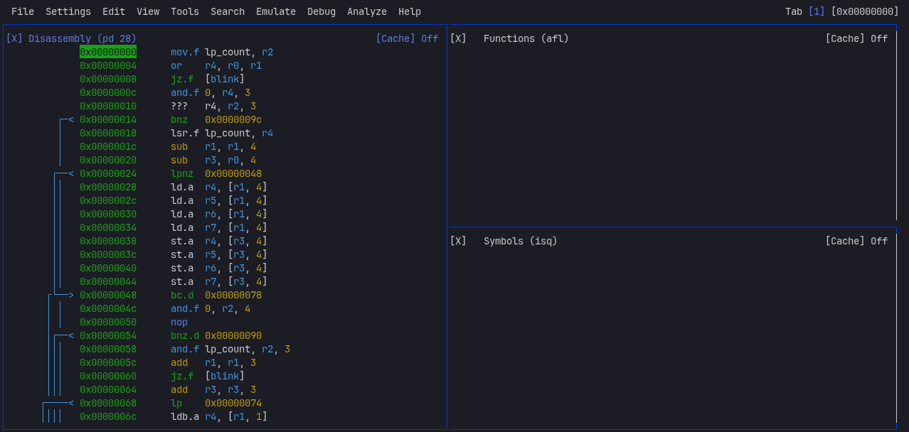

## About
e is a reverse intel me 1/11 project

### Moree
I aim to fully analyze the Intel Management Engine using r2, Rizin, and Ghidra. My goals are to create documentation, reconstruct the original C code, and study the drivers. I plan to use Zig for automation throughout the process. Please note that this is a long-term, secondary project due to the immense workload and the obscure architecture of Intel ME 1. I recommend watching the repository for updates. Upon completion, I plan to publish an article on Habr. Due to the titanic effort required, AI tools are being used to assist in this project.

UPD: я завершил работу с 1 ме, во первых там очень скучно ( [see](reverse/me1/inf.txt) ) во вторых rizin не справляется с таким каллокодом, в 2 там ужасная архитектура arc, в четвертых я не нашел там фана, только 1 DEADBEEF и очень много ( крайне не интересных и простых ) уязвимостей, и они не полезны для меня ведь все мои пк с me1 давно пропатчены через... me_cleaner, но кому интересно ( [see](reverse/me1/doc/vulnerability.txt) ) могут ознакомится, я перейду к 11 версии, уверен там больше интересного,и я хотяб смогу получить чтото типо баг баунти, а ну еще я написал утилиту [m1u](code/m1u/m1u) чтобы получать модули, ну сами поймете че это, [почитайте](code/m1u/info.txt) а ну еще скоро в папке doc будет полный стркутурированый отчет в виде md а не txt, но пока мне лень

UPD: я начал заниматся 11, ( я просто перешел в папку ) и мне скинул кент 16 версию ме, ее потом тоже буду изучать, снова пока

UPD: я все же продолжил работу с этим, так вот, [see](reverse/me1/doc/allowunsignedassertstolen.txt)

UPD: утилита m1u успешно извлекла все 18 модулей из прошивки ME1 (100% success rate) [see](reverse/me1/doc/note/ALL_MODULES.txt)

UPD: скоро в проекте начнется калосальные работы, полная ПОЛНАЯ документация intel me1 , максимально полеостью))

UPD: я сделал патч в rizin... ( [see](https://github.com/rizinorg/rizin/pull/5922) ), чтобы пофиксить '???' ( [see](reverse/me1/doc/note/rizin_arc_unknown_instructions.txt) [see](reverse/me1/doc/note/rizin_arc_patch_summary.txt) [see](reverse/me1/doc/note/rizin_arc_patch.txt) ), тем самым я пофиксил ошибку с 1 огромной afl ( [see](reverse/me1/doc/note/rizin_arc_function_analysis_fix.txt) ).
 

---

### Contact

Telegram: [zarazaex](https://t.me/zarazaexe)
 
Email: [zarazaex@tuta.io](mailto:zarazaex@tuta.io)
 
Site: [zarazaex.xyz](https://zarazaex.xyz)
 

